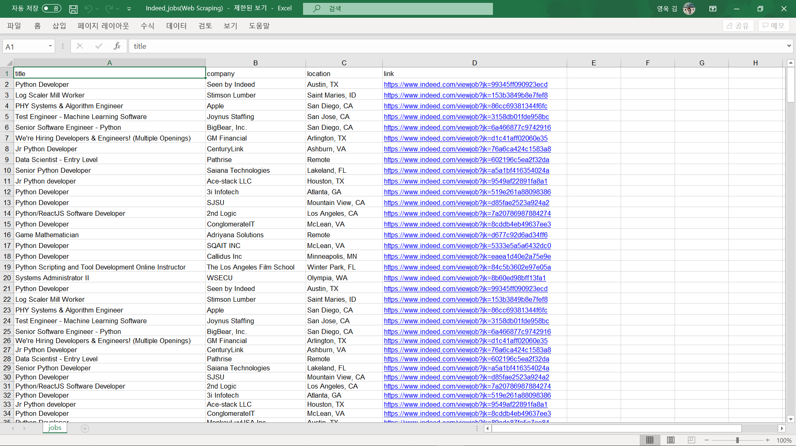

# Python Course
Nomad coders's Python Course
It's started since 2020.01.27.~2020.02.11.

## Website
- https://github.com/wook2124/requests
- https://www.crummy.com/software/BeautifulSoup/bs4/doc/
- https://docs.python.org/3/library/stdtypes.html#sequence-types-list-tuple-range
- https://stackoverflow.com/jobs?q=python
- https://www.indeed.com/jobs?q=python&limit=50

## Demo Pictures

## Project Description 
I easily got a job data on the site through web-scraping. Try web-scraping with Python!  
웹스크래핑을 통해 그 사이트에 있는 직업 자료를 쉽게 얻었습니다. 여러분들도 Python으로 웹스크래핑을 해보세요!

## What I used for this project 
- Python
